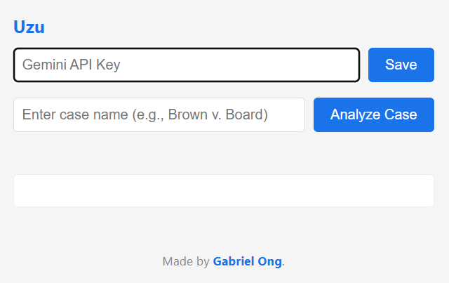
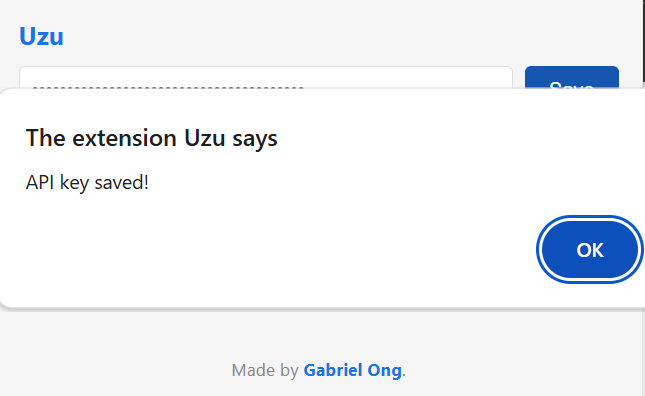
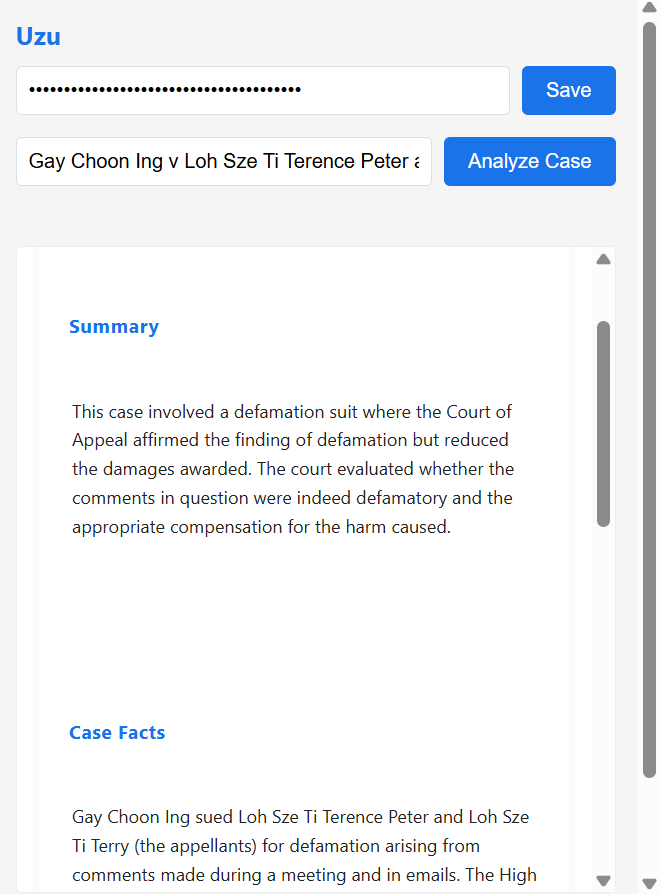
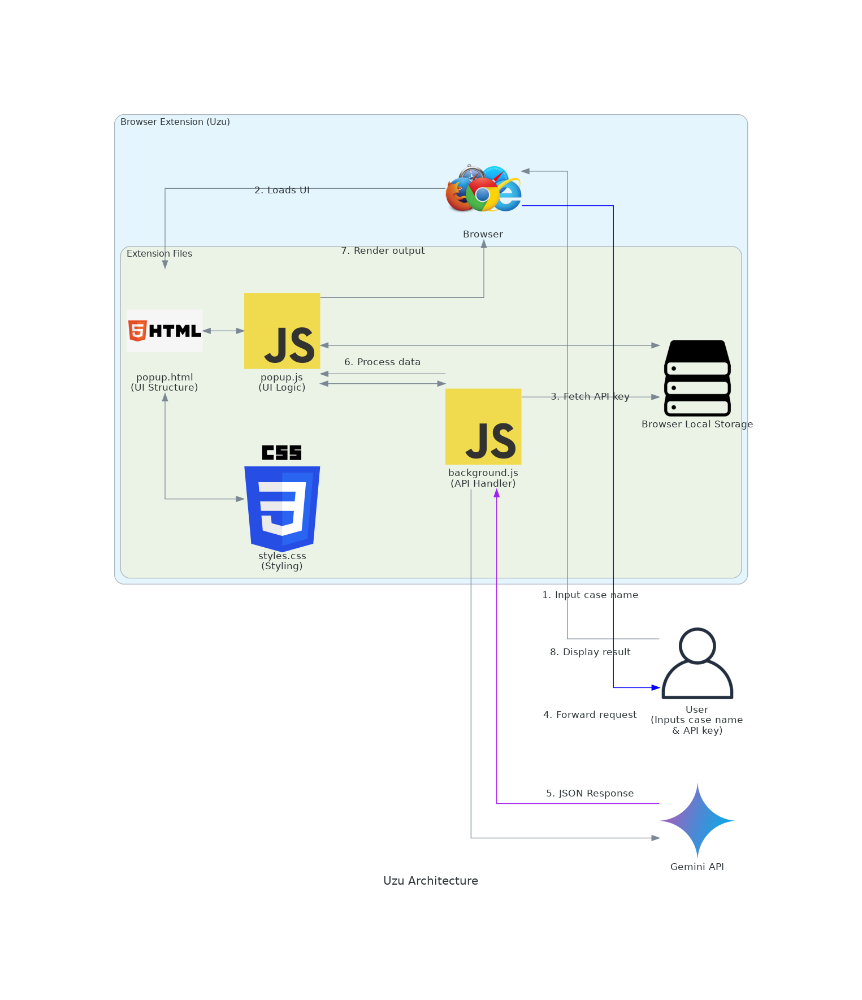

[](https://github.com/gongahkia/uzu/releases/tag/1.0.0) 

# `Uzu`

...

A simple browser extension that makes life *(marginally)* easier.

`Uzu` destructures [Legal Case Facts and their Judgements](https://www.judiciary.gov.sg/judgments/judgments-case-summaries) into its essential components, all from only a [Case Name](https://researchguides.smu.edu.sg/c.php?g=421855&p=2881046) *(or [Case Citation](https://en.wikipedia.org/wiki/Case_citation))*.

## Stack

* *Frontend*: 
* *Backend*: 
* *DB*: 

## Screenshots





## Architecture



## Usage

> [!IMPORTANT]  
> Read the [legal disclaimer](#legal-disclaimer) before using `Uzu`.  

1. Clone the repository.

```console
$ git clone https://github.com/gongahkia/uzu
```

2. Get your [Gemeni API key](https://ai.google.dev/gemini-api/docs/api-key).

Then follow the below instructions for your browser.

### Firefox

1. Copy and paste this link in the search bar *about:debugging#/runtime/this-firefox*.
2. Click *load temporary add-on*.
3. Open the `Uzu` repo, select `manifest.json`.
4. Click the toggle button to open the `Uzu` browser extension.
5. Input your Gemeni API Key and *save*.

### Chrome

1. Copy and paste this link in the search bar *chrome://extensions/*.
2. Toggle *Developer mode* on.
3. Click *load unpacked*.
4. Open the `Uzu` repo, click *select*.
5. Click the toggle button to open the `Uzu` browser extension.
6. Input your Gemeni API Key and *save*.

Support for other browsers like Opera, Vivaldi have not been extensively tested, but this extension should work. Open an issue for further support.

## Other notes

This might be a simple tool, but its something I've wanted to make ever since I entered [Computing & Law](https://computing.smu.edu.sg/bsc-computing-law) in 2023.

## Reference

The name `Uzu` is in reference to [Maximum: Uzumaki](https://jujutsu-kaisen.fandom.com/wiki/Maximum:_Uzumaki) (極ノ番), the [Maximum Technique](https://jujutsu-kaisen.fandom.com/wiki/Cursed_Technique#Maximum_Techniques) of [Suguru Geto](https://jujutsu-kaisen.fandom.com/wiki/Suguru_Geto) (夏油傑) from the completed manga series [Jujutsu Kaisen](https://jujutsu-kaisen.fandom.com/wiki/Jujutsu_Kaisen_Wiki). It is also a reference to [Junji Ito](https://en.wikipedia.org/wiki/Junji_Ito)'s 1998 manga series of the [same name](https://en.wikipedia.org/wiki/Uzumaki).

<div align="center">
    
</div>

## Legal disclaimer

The Uzu browser extension ("Uzu") is provided "AS IS" and "AS AVAILABLE," without warranty of any kind, express or implied. By using Uzu, you acknowledge that you have read, understood, and agree to be bound by this disclaimer's below terms and limitations.

### No Responsibility Disclaimer

The information provided by Uzu through its legal case summarization services is for general informational purposes only. Uzu and its creators make no representation or warranty of any kind, express or implied, regarding the accuracy, adequacy, validity, reliability, availability, or completeness of any information generated through the extension.

### Use at Your Own Risk

Your use of Uzu and its features is entirely at your own risk. Uzu's creators and contributors shall not be liable for any errors or omissions in the content provided, nor for any actions taken in reliance thereon.

### AI-Generated Content Limitations

Summaries and other content generated by Uzu using the Gemini Flash 2.0 API are created through artificial intelligence and may contain inaccuracies, misinterpretations, or incomplete information. Users should:
* Not rely solely on AI-generated legal case summaries for critical decisions
* Verify all information against original legal sources and documents
* Understand that AI summarization is not a substitute for legal advice or thorough case review

### No Legal Advice

Uzu does not provide legal advice or other professional services. The legal case summaries and information generated should not be construed as legal consultation or advice. Users requiring legal guidance should consult qualified legal professionals. Nothing contained in the summaries constitutes a solicitation, recommendation, endorsement, or offer to provide legal services.

### Intellectual Property

Users are responsible for ensuring they have the necessary rights to process legal case documents through Uzu. The extension does not claim ownership of user-accessed content, but users grant Uzu the right to process and analyze such content for the purpose of providing summarization services.

### Third-Party Services

Uzu utilizes third-party services including but not limited to the Gemini Flash 2.0 API. The use of these services is subject to their respective terms and conditions. Uzu's creators are not responsible for the performance, availability, or policies of these third-party services.

### Limitation of Liability

Under no circumstances shall Uzu's creators or contributors be liable for any indirect, incidental, special, consequential, or punitive damages resulting from your use of or inability to use the extension. Uzu is not liable for any decisions made or actions taken based on the summaries provided.

### Changes to Disclaimer

This disclaimer may be updated from time to time without notice. It is your responsibility to review this disclaimer periodically for changes.

### Data Privacy

Information processed through Uzu may be transmitted to and processed by third-party API services. By using Uzu, you consent to such processing and transmission. Users should review the privacy policies of the Gemini Flash 2.0 API and other integrated services for further information on data handling practices.